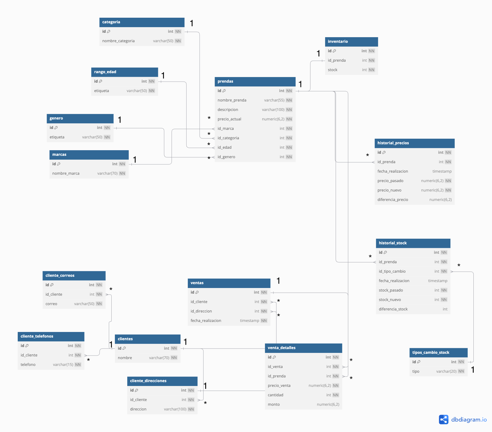

# Sistema de Reportes para un Negocio de Ropa

Este proyecto consiste en una aplicación completa que permite generar reportes visuales sobre las ventas, inventario, producots y clientes en una tienda de ropa. Las tecnologías que se utilizaron fueron:

- Frontend: React, HTML, CSS, y Chart.js para poder generar gráficos.
- Backend: Express para la creación de los endpoints, y PostgreSQL para la base de datos.
- Docker: Contenedores para frontend, backend y la base de datos.

## Qué se puede hacer?

La aplicación permite generar reportes en base a filtros, en estos se podrá visualizar una tabla con los datos, un gráfico, y se tendrá un botón por si se decide exportar los datos como CSV.

Los reportes que se podrán generar son:

1. Clientes con mayor cantidad de gastos en un período específico.
2. Top productos por ingresos generados.
3. Prendas con mayor stock.
4. Clientes con mayor cantidad de productos adquiridos.
5. Historial de cambios de precios en las prendas. 

Dependiendo del reporte seleccionado, los filtros que se pueden seleccionar son:

- Marca
- Categoría
- Género
- Rango de Edad (si es niño o adulto)
- De hace cuántos meses se quiere el reporte
- Precio de prenda
- Gasto mínimo 

## **Configuración de Proyecto**

1. ==Variables de Entorno (.env)==

Busca el archivo .env.example y renombralo a .env, y configura todas tus variables de entorno según los puertos que tengas libres en tu computadora.

2. ==Docker Compose (docker-compose.yml)==

Busca el archivo docker-compose.yml.example y renombralo a docker-compose.yml, no es necesario modificar más, pues se toma la información que hayas colocado en tu .env.

3. ==Modificar URL del API en el Frontend (index.html)==

Busca el archivo en la carpeta de frontend, a partir de acá, busca la variable apiUrl, puedes hacerlo utilizando Ctrl + F, o Cmd + F para encontrarla, y así modificar su valor, que actualmente es "http://localhost:3000", para lo que hayas dejado configurado en tus variables de entorno. Esto es necesario pues se llama frecuentemente a esta variable para poder hacer fetch a la información que proveen los endpoints definidos en el backend.

4. ==Levantar el Proyecto con Docker Compose==

Una vez hayas hecho todo lo descrito en los pasos anteriores, puedes correr en tu terminal el comando: `docker-compose up --build`, para poder construir los contenedores necesarios para el proyecto, y así poder dirigirte a "http:localhost:TuPuertoFrontend", y así comenzar a interactuar con la aplicación.

## Estructura de Base de Datos

La base de datos tiene tablas para:

- Clientes (clientes, cliente_telefonos, cliente_direcciones, cliente_correos)
- Productos (prendas, categoría, marcas, genero, rango_edad)
- Inventario (inventario)
- Ventas (ventas, venta_detalles)
- Historiales (historial_precios, historial_stock)

---

Para mayor información de las relaciones y su cardinalidad, este es el digrama ER:

